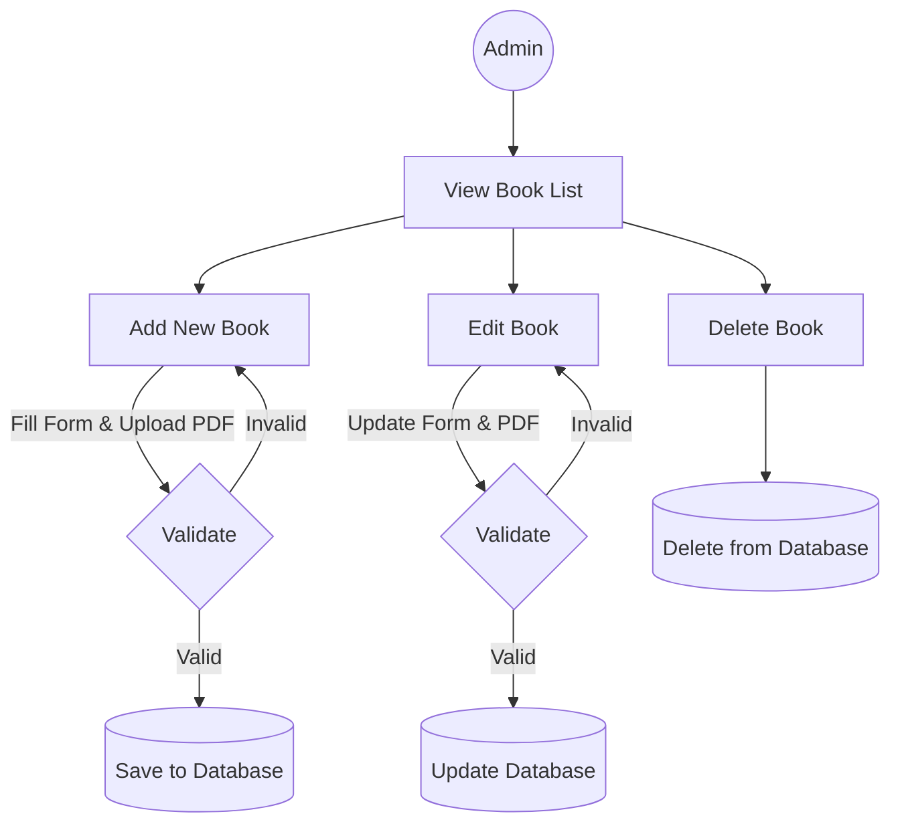
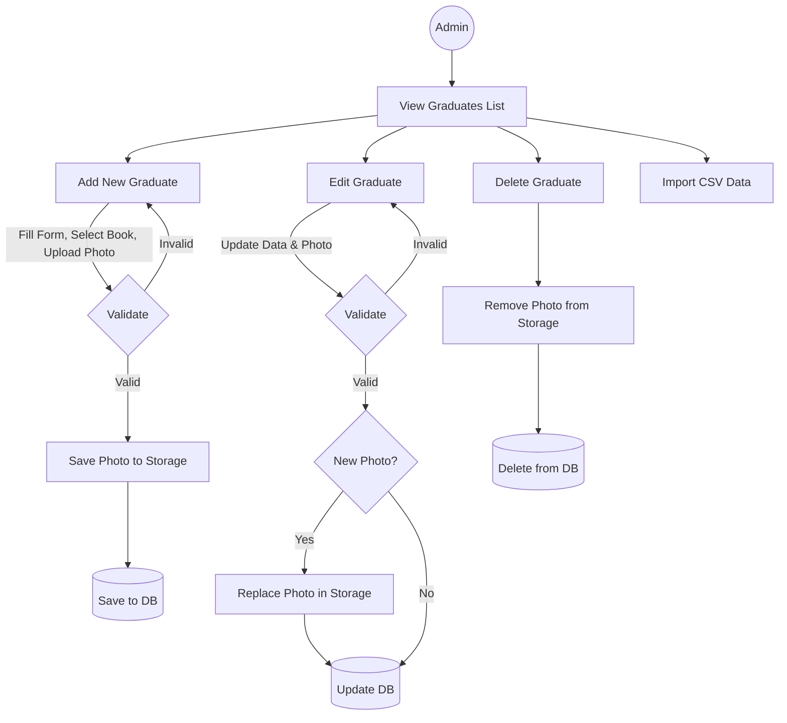
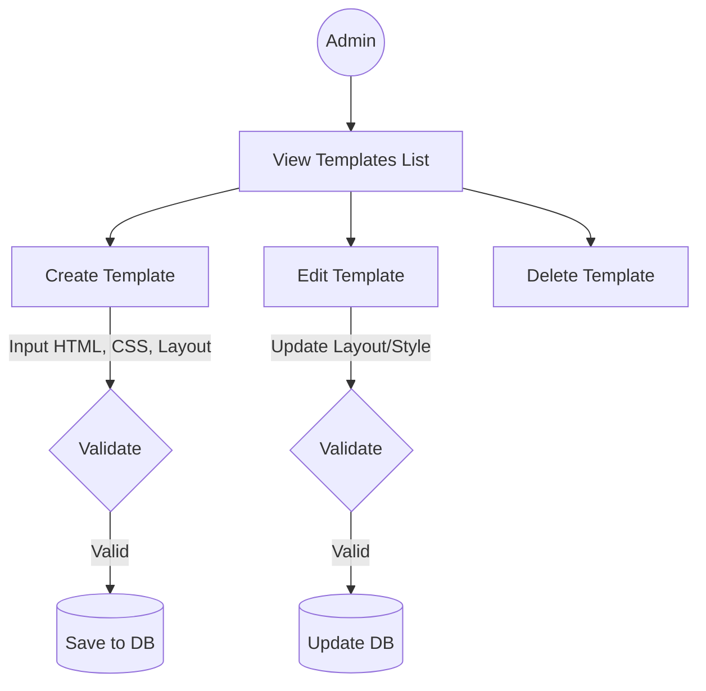
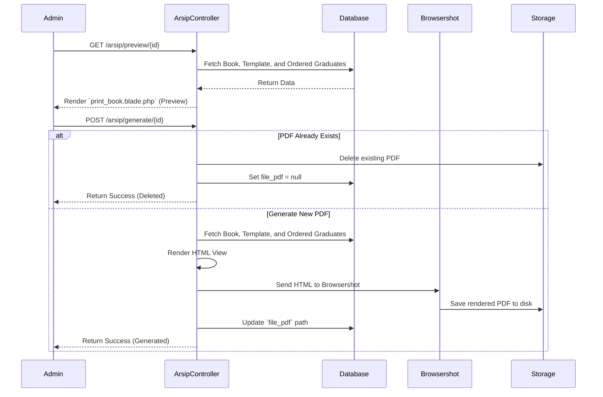

# Admin Processes

This document outlines the CRUD operations and management processes available to the Administrator.

## 1. Manage Buku Wisuda (Graduation Books)
Processes for creating and managing graduation books.

## 2. Manage Wisudawan (Graduates)
Processes to manage individual graduate data, including photo uploads and assignments to a book.

## 3. Manage Templates
Processes for managing the layout and styling templates for the generated graduation books.

## 4. Document Generation (Arsip)
Processes related to previewing and generating the final PDF version of the graduation book using the assigned template and populated graduate data.

