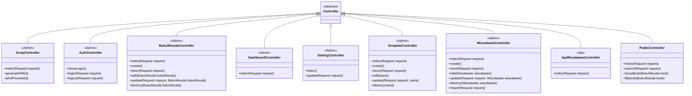

```mermaid
classDiagram
    class Controller {
        <<abstract>>
    }

    class ArsipController {
        <<Admin>>
        +index(Request request)
        +generatePdf(id)
        +printPreview(id)
    }

    class AuthController {
        <<Admin>>
        +showLogin()
        +login(Request request)
        +logout(Request request)
    }

    class BukuWisudaController {
        <<Admin>>
        +index(Request request)
        +create()
        +store(Request request)
        +edit(BukuWisuda bukuWisuda)
        +update(Request request, BukuWisuda bukuWisuda)
        +destroy(BukuWisuda bukuWisuda)
    }

    class DashboardController {
        <<Admin>>
        +index(Request request)
    }

    class SettingController {
        <<Admin>>
        +index()
        +update(Request request)
    }

    class TemplateController {
        <<Admin>>
        +index(Request request)
        +create()
        +store(Request request)
        +edit(nama)
        +update(Request request, nama)
        +destroy(nama)
    }

    class WisudawanController {
        <<Admin>>
        +index(Request request)
        +create()
        +store(Request request)
        +edit(Wisudawan wisudawan)
        +update(Request request, Wisudawan wisudawan)
        +destroy(Wisudawan wisudawan)
        +import(Request request)
    }

    class ApiWisudawanController {
        <<Api>>
        +index(Request request)
    }

    class PublicController {
        +index(Request request)
        +search(Request request)
        +showBook(BukuWisuda book)
        +flipbook(BukuWisuda book)
    }

    Controller <|-- ArsipController
    Controller <|-- AuthController
    Controller <|-- BukuWisudaController
    Controller <|-- DashboardController
    Controller <|-- SettingController
    Controller <|-- TemplateController
    Controller <|-- WisudawanController
    Controller <|-- ApiWisudawanController
    Controller <|-- PublicController
```
