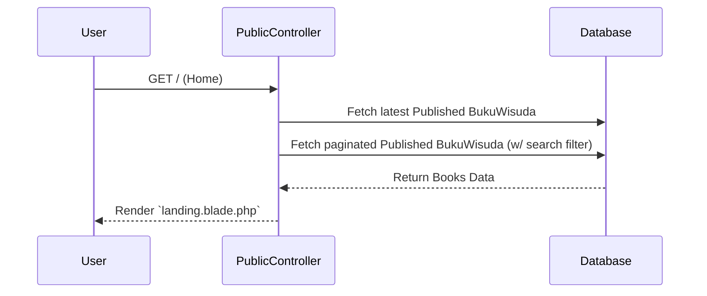
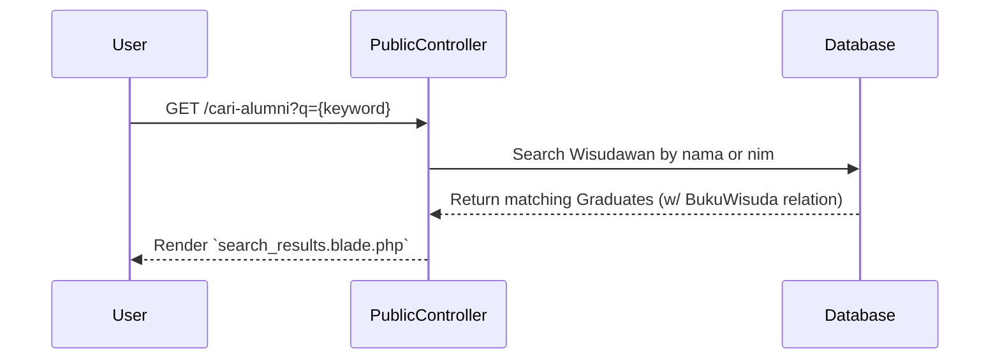
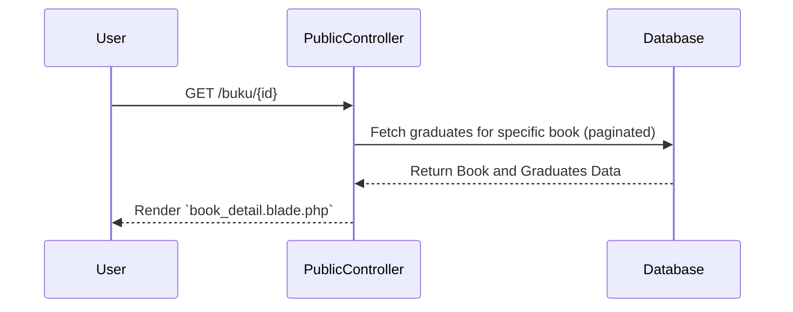
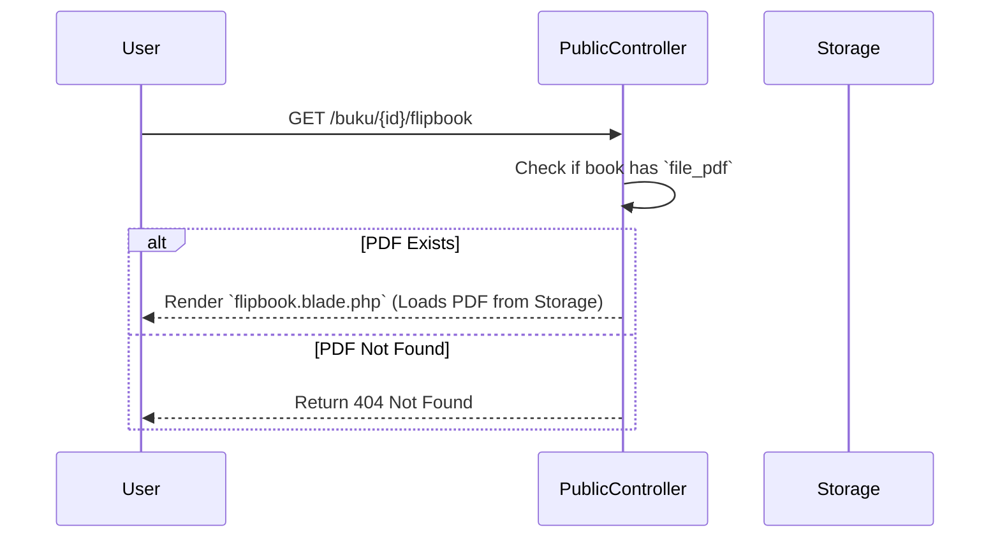

# Public User Processes

This document outlines the processes and data flows available to public users in the Graduation Management system.

## 1. View Landing Page & Book List
Displays the latest published graduation book and a paginated list of all published books. Includes a search function for books.

## 2. Search Alumni (Wisudawan)
Allows users to search for specific graduates by name or student ID (NIM).

## 3. View Book Details
Displays the details of a specific graduation book and the list of graduates in that book.

## 4. View Flipbook
Allows users to view the generated PDF of a graduation book in a flipbook format.

